# processing-fractal-flames
Processing implementation of the Fractal Flames algorithm. This was a side project I made on a weekend in 2015 and is only on GitHub for reference purposes. The code style no longer represents my code style. All pull requests are rejected. If you're searching for (much better) implementations of fractal flames, take a look at [Electric Sheep](https://electricsheep.org) or read the [original paper](http://flam3.com/flame.pdf).

## Gallery

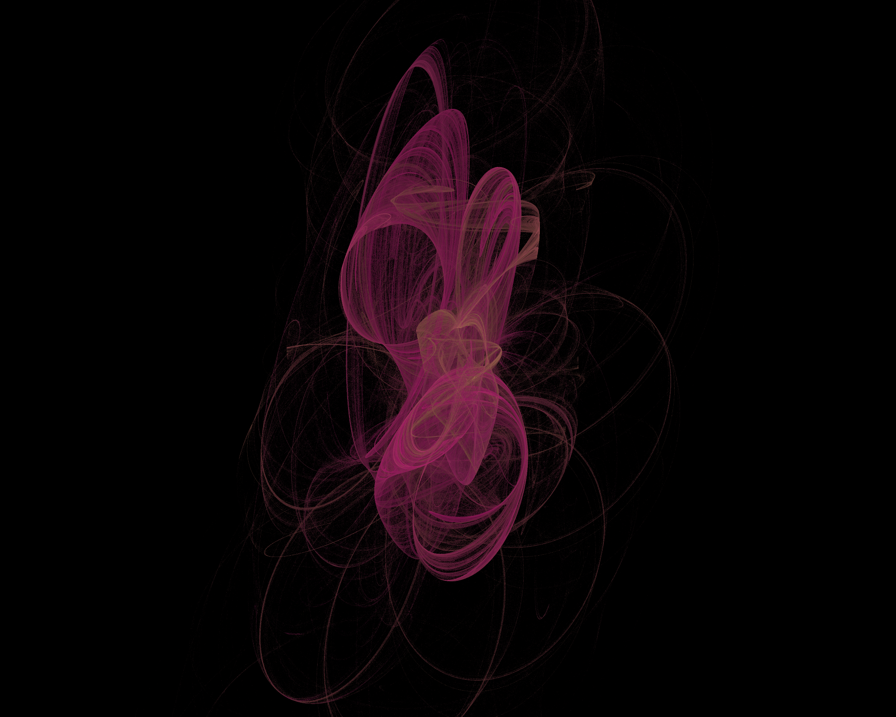
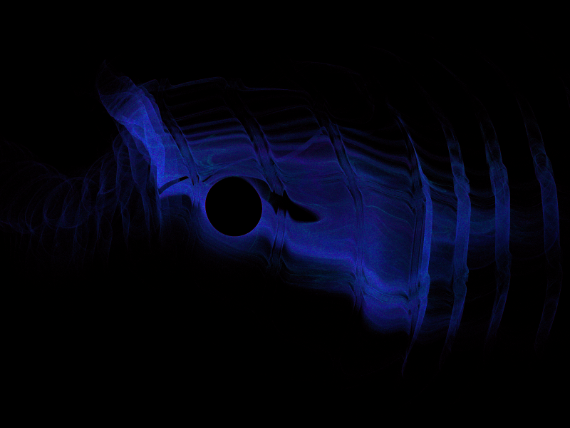
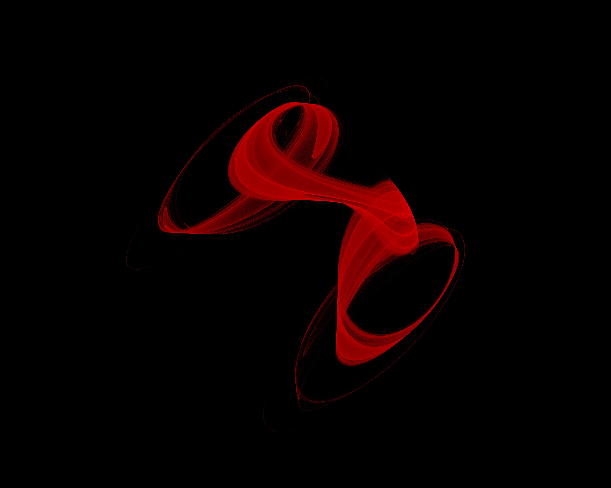

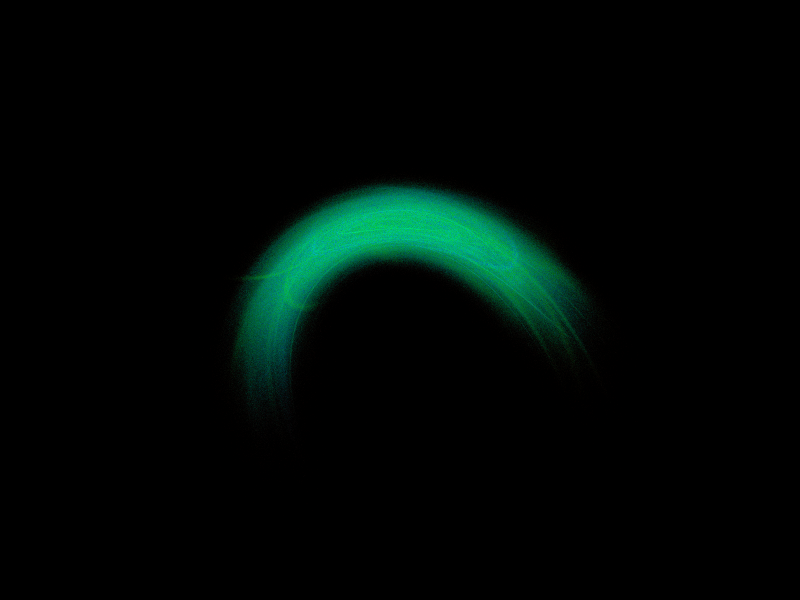

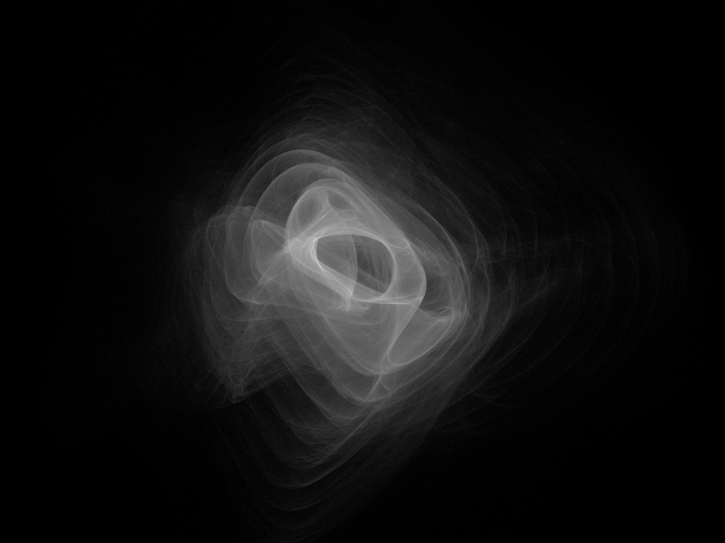
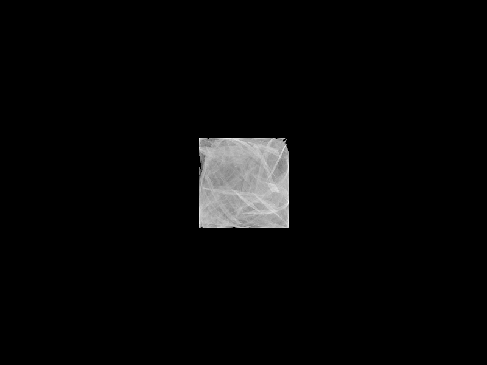
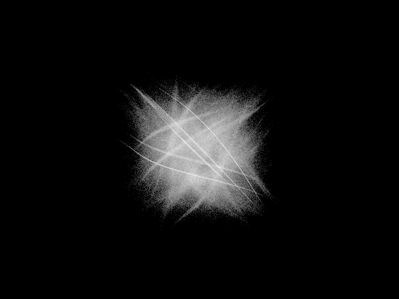
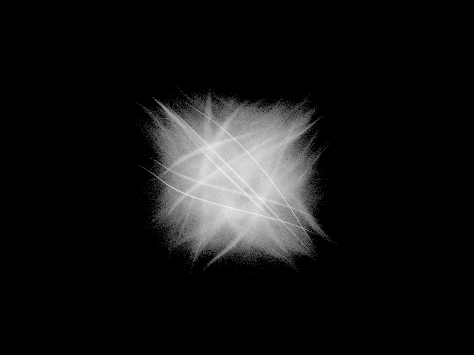
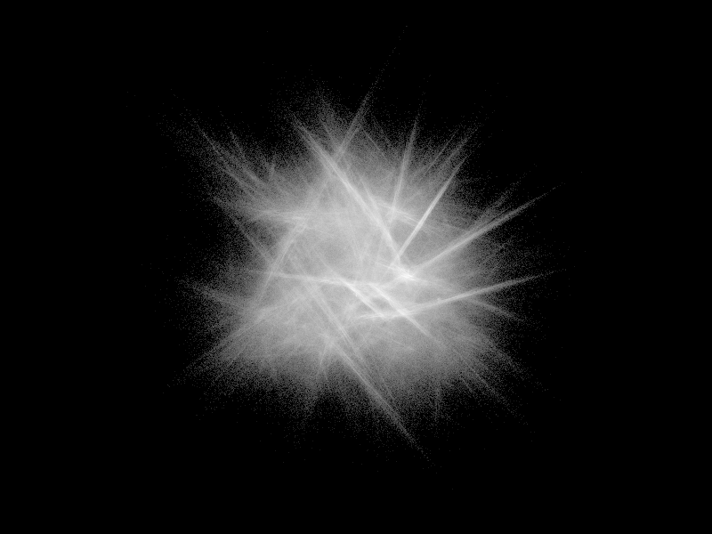
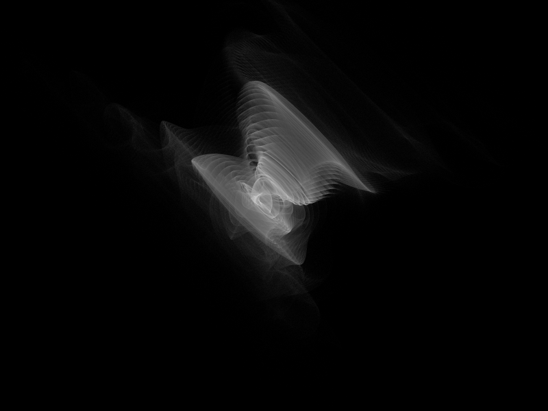
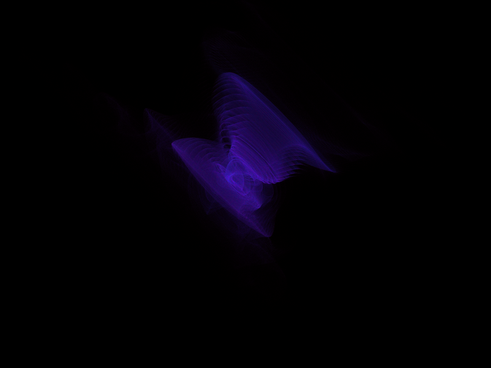
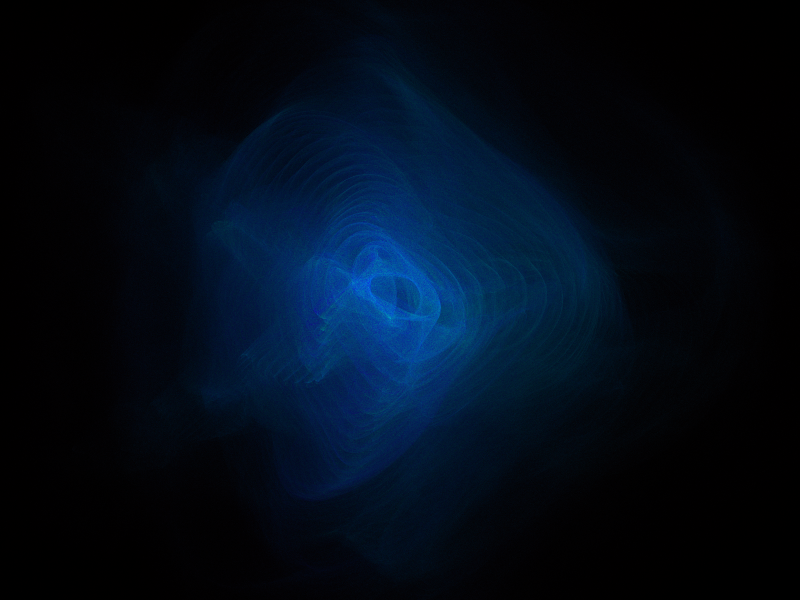
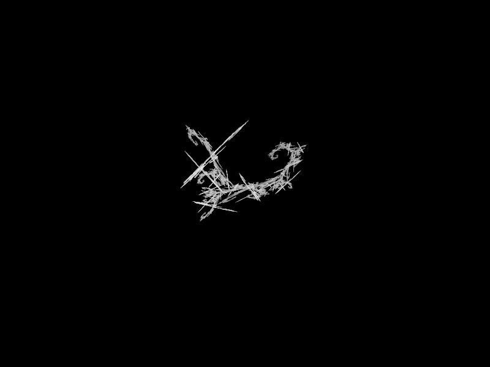
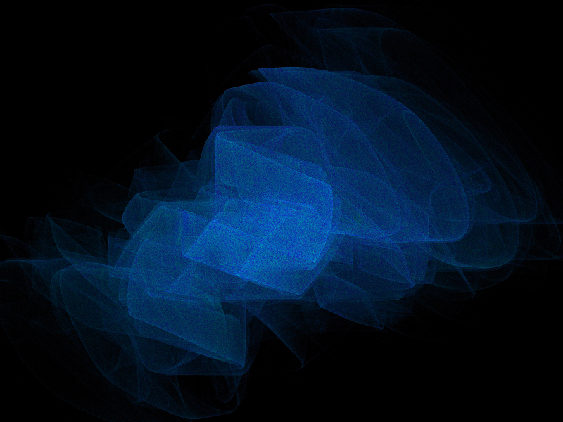
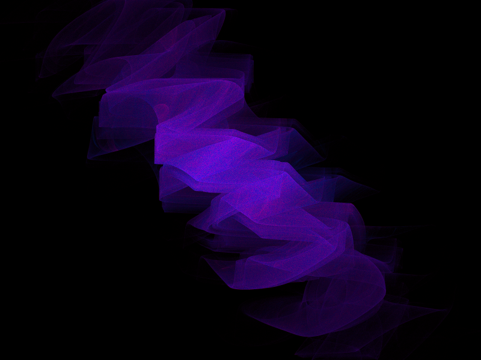

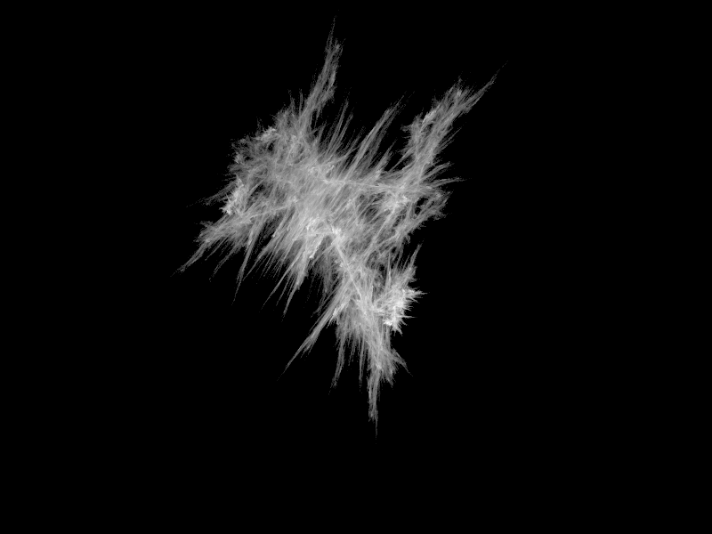
